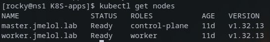
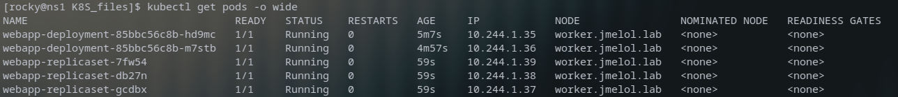
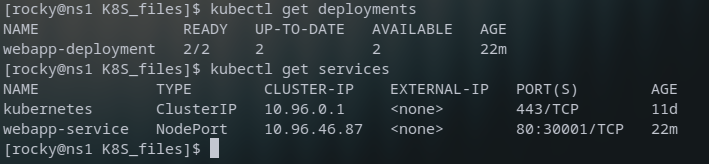
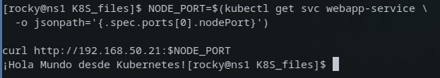
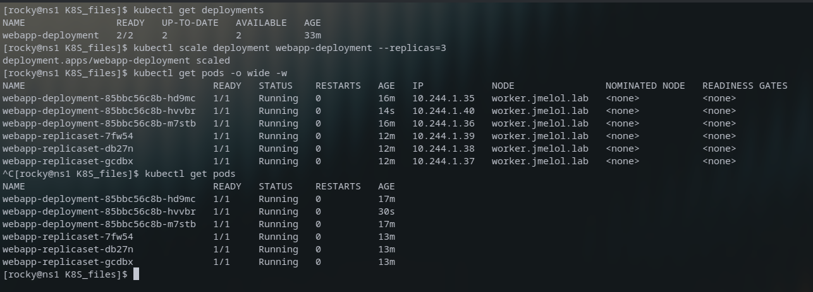
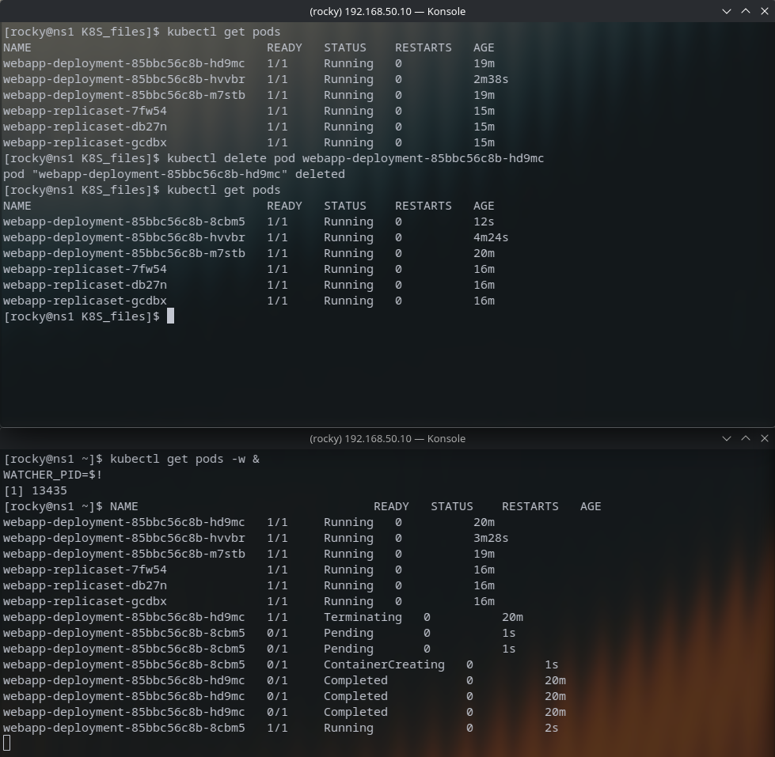

# Práctica Kubernetes — Despliegue de Aplicaciones en Clúster kubeadm

> **Asignatura:** Infraestructura III  
> **Tema:** Orquestación de contenedores con Kubernetes  
> **Entorno:** Clúster kubeadm `v1.32.13` | Rocky Linux 9.7 | KVM | Flannel CNI  
> **Repositorio base:** [mariocr73/K8S-apps](https://github.com/mariocr73/K8S-apps)  
> **Infraestructura:** [Melo088/net-lab-ansible](https://github.com/Melo088/net-lab-ansible.git)

---

## Tabla de Contenidos

1. [Descripción del Entorno](#1-descripción-del-entorno)
2. [Fase 1 — Preparación y verificación del clúster](#2-fase-1--preparación-y-verificación-del-clúster)
3. [Fase 2 — Análisis y corrección de manifiestos YAML](#3-fase-2--análisis-y-corrección-de-manifiestos-yaml)
4. [Fase 3 — Despliegue de la aplicación](#4-fase-3--despliegue-de-la-aplicación)
5. [Fase 4 — Exposición del servicio](#5-fase-4--exposición-del-servicio)
6. [Fase 5 — Escalamiento horizontal](#6-fase-5--escalamiento-horizontal)
7. [Fase 6 — Prueba de resiliencia (Self-Healing)](#7-fase-6--prueba-de-resiliencia-self-healing)
8. [Análisis Técnico](#8-análisis-técnico)
9. [Conclusión](#9-conclusión)

---

## 1. Descripción del Entorno

El laboratorio opera sobre un clúster Kubernetes construido manualmente con `kubeadm`, ejecutado en máquinas virtuales KVM gestionadas con Ansible sobre un host Fedora 43.

### Topología de red

| Nodo | IP | Rol | OS |
|------|----|-----|----|
| `ns1.jmelol.lab` | `192.168.50.10` | Bastión — DNS + DHCP + kubectl | Rocky Linux 9.7 |
| `master.jmelol.lab` | `192.168.50.20` | Control Plane | Rocky Linux 9.7 |
| `worker.jmelol.lab` | `192.168.50.21` | Worker | Rocky Linux 9.7 |

**Stack tecnológico:**

| Componente | Versión |
|------------|---------|
| Kubernetes | `v1.32.13` |
| Container runtime | `containerd 2.2.2` |
| CNI plugin | Flannel (pod network: `10.244.0.0/16`) |
| Red de servicios | `10.96.0.0/12` |

---

## 2. Fase 1. Preparación y verificación del clúster

### 2.1 Arranque del entorno (desde Fedora 43 host)

```bash
# Verificar red KVM
sudo virsh net-list --all

# Encender VMs en orden correcto (ns1 primero para que DHCP esté listo)
sudo virsh start dns-dhcp-server
sleep 20
sudo virsh start k8s-master
sudo virsh start k8s-worker

# Confirmar que las tres están corriendo
sudo virsh list --all
```

### 2.2 Verificar alcance de Ansible

```bash
cd ~/University/InfraIII/lab1
source .venv/bin/activate
cd lab1-ansible-dns-dhcp
ansible all -m ping
```

### 2.3 Conectarse al bastión y verificar el clúster

```bash
ssh -i ~/.ssh/ansible_lab rocky@192.168.50.10

# Una vez en ns1:
kubectl get nodes -o wide
```

**Captura 1. Estado de nodos:**



> Ambos nodos muestran `STATUS=Ready`. Si `worker` aparece como `SchedulingDisabled`, se debe ejecutar `kubectl uncordon worker.jmelol.lab`.

### 2.4 Clonar el repositorio de la práctica

```bash
git clone https://github.com/mariocr73/K8S-apps.git
cd K8S-apps/K8S_files
ls -la
```

---

## 3. Fase 2. Análisis y corrección de manifiestos YAML

### 3.1 Inventario de archivos encontrados

```bash
for f in $(find . -name "*.yaml" -o -name "*.yml"); do
  echo "=== $f ==="
  cat "$f"
  echo ""
done
```

El repositorio contiene **6 archivos YAML** con los siguientes recursos:

| Archivo | `kind` | Descripción |
|---------|--------|-------------|
| `webapp-configmap.yaml` | `ConfigMap` | Variable de entorno `APP_ENV: production` |
| `webapp-dbsecret.yaml` | `Secret` | Credenciales de base de datos |
| `webapp-dhsecret.yaml` | `Secret` | Credenciales de registro Docker (imagen privada) |
| `webapp-deployment.yaml` | `Deployment` | Gestiona 2 réplicas (escalado a 3) |
| `webapp-replicaset.yaml` | `ReplicaSet` | 3 réplicas independientes |
| `webapp-service.yaml` | `Service` | NodePort 30001 — expone la app al exterior |

### 3.2 Construcción y publicación de la imagen Docker

Antes de desplegar se construyó la imagen desde el `Dockerfile` del repositorio y se publicó en Docker Hub siguiendo el Step 1 del README original:

```bash
# En el host Fedora, dentro del directorio clonado
docker build -t webapp .
docker tag webapp:latest melo15036/webapp:v1
docker login
docker push melo15036/webapp:v1
```

Imagen disponible en: [hub.docker.com/r/melo15036/webapp](https://hub.docker.com/r/melo15036/webapp)

### 3.3 Problemas encontrados y correcciones aplicadas

Los manifiestos del repositorio contenían **valores placeholder** que debían completarse antes del despliegue. Se identificaron y corrigieron los siguientes problemas:

---

#### Problema 1. Secrets con placeholders no codificados en Base64

**Error obtenido al ejecutar `kubectl apply -f .`:**

```
Error from server (BadRequest): error when creating "webapp-dbsecret.yaml":
Secret in version "v1" cannot be handled as a Secret:
illegal base64 data at input byte 0
```

**Causa:** El campo `data:` en un `Secret` exige valores estrictamente codificados en Base64. Los archivos tenían texto literal como `<valor_del_nombre_de_usuario_en_base64>`, donde el carácter `<` no existe en el alfabeto Base64 y falla en el byte 0.

**Corrección — `webapp-dbsecret.yaml`:**

```yaml
# ANTES (roto):
data:
  db_username: <valor_del_nombre_de_usuario_en_base64>
  db_userpassword: <valor_de_la_contraseña_en_base64>

# DESPUÉS (corregido con stringData):
stringData:
  db_username: admin
  db_userpassword: superpassword
```

**Corrección — `webapp-dhsecret.yaml`:**

```yaml
# ANTES (roto):
data:
  username: <valor_del_usuario_en_base64>
  password: <valor_de_la_contraseña_en_base64>
  email: <valor_del_correo_en_base64>

# DESPUÉS (corregido):
stringData:
  username: mi_usuario_lab
  password: mi_password_lab
  email: estudiante@jmelol.lab
```

> **Nota técnica:** `stringData` es un campo de conveniencia que acepta texto plano. Kubernetes lo convierte a Base64 internamente al persistir el objeto en etcd. Es equivalente a ejecutar `echo -n "admin" | base64` y pegar el resultado en el campo `data:`.

---

#### Problema 2. Imagen placeholder e `InvalidImageName` en Deployment y ReplicaSet

**Estado original:**

```yaml
containers:
- name: app-container
  image: <nombre_de_usuario_en_docker_hub>/<nombre_del_repositorio>:<tag>
  ports:
  - containerPort: 5000
imagePullSecrets:
- name: regcred
```

**Error resultante:** Los pods entraban en estado `InvalidImageName` porque Kubernetes no puede resolver los literales `<...>` como una referencia de imagen Docker válida.

**Corrección aplicada a `webapp-deployment.yaml` y `webapp-replicaset.yaml`:**

```yaml
containers:
- name: app-container
  image: melo15036/webapp:v1   # imagen propia publicada en Docker Hub
  ports:
  - containerPort: 5000        # puerto en el que corre la aplicación
imagePullSecrets:
- name: regcred                # secret con credenciales del registro
```

---

#### Problema 3. `targetPort` desajustado en el Service

El Service tenía el `targetPort` apuntando al valor por defecto del placeholder (`5000`), pero fue necesario verificarlo y alinearlo explícitamente con el `containerPort` de la aplicación:

```yaml
# ANTES (desajustado respecto al contenedor real):
targetPort: 5000   # coincide con containerPort ✓ — pero port: 80 generaba confusión

# DESPUÉS (alineado y consistente):
ports:
  - protocol: TCP
    port: 80          # puerto del Service dentro del clúster
    targetPort: 5000  # puerto real donde escucha la app en el contenedor
    nodePort: 30001   # puerto externo accesible desde fuera del clúster
```

> **Relación de puertos:** `nodePort (30001)` → `port (80)` → `targetPort (5000)`. El tráfico externo entra por 30001, el Service lo recibe en 80 y lo reenvía al puerto 5000 del contenedor donde corre la aplicación.

---

### 3.4 Pregunta obligatoria: ¿Por qué usar Deployment en lugar de crear Pods directamente?

Un Pod creado manualmente en Kubernetes es **efímero y sin supervisor**. Si ese Pod falla, es eliminado o el nodo que lo aloja cae, el Pod desaparece permanentemente: ningún componente del sistema tiene responsabilidad de recrearlo.

Un **Deployment** introduce gestión declarativa mediante tres mecanismos clave:

**1. ReplicaSet como controlador de estado deseado**

El Deployment crea un `ReplicaSet` que actúa como guardián. El `ReplicaSet Controller` (dentro del `kube-controller-manager` en el nodo master) ejecuta continuamente un loop de reconciliación:

```
estado_deseado (.spec.replicas) ≠ estado_actual (pods corriendo)
         → crear / eliminar pods hasta igualar
```

**2. Self-healing automático**

Si un pod muere, el ReplicaSet Controller detecta la divergencia en milisegundos y ordena la creación de un pod de reemplazo. Sin intervención del administrador.

**3. Rolling updates y rollbacks sin downtime**

Al cambiar la imagen, el Deployment reemplaza pods gradualmente. `kubectl rollout undo` puede revertir a cualquier revisión anterior en segundos.

Un Deployment es *declarativo y resiliente*. Ninguna carga de trabajo debería ejecutarse como Pod sin controlador.

---

## 4. Fase 3. Despliegue de la aplicación

```bash
# Desde K8S-apps/K8S_files/
kubectl apply -f .
```

**Salida obtenida (1er intento — antes de corregir Secrets):**

```
configmap/webapp-configmap created
deployment.apps/webapp-deployment created
replicaset.apps/webapp-replicaset created
service/webapp-service created
Error from server (BadRequest): ...illegal base64 data at input byte 0  ← Secrets
```

**Salida obtenida (2do intento — tras corregir todos los archivos):**

```
configmap/webapp-configmap unchanged
secret/db-secrets          created
deployment.apps/webapp-deployment unchanged
secret/regcred             created
replicaset.apps/webapp-replicaset unchanged
service/webapp-service     unchanged
```

> `unchanged` es parte del modelo **declarativo** de Kubernetes: re-aplicar manifiestos sin cambios no genera efectos secundarios. Solo actúa sobre lo que difiere del estado almacenado en etcd.

```bash
kubectl get pods -o wide
kubectl get deployments
kubectl get services
```

**Captura 2. Todos los pods en Running:**



**Captura 3. Deployments y Services:**



**Salida real:**

```
NAME                                 READY   STATUS    RESTARTS   AGE   IP            NODE
webapp-deployment-85bbc56c8b-hd9mc   1/1     Running   0          17m   10.244.1.35   worker.jmelol.lab
webapp-deployment-85bbc56c8b-m7stb   1/1     Running   0          17m   10.244.1.36   worker.jmelol.lab
webapp-replicaset-7fw54              1/1     Running   0          13m   10.244.1.39   worker.jmelol.lab
webapp-replicaset-db27n              1/1     Running   0          13m   10.244.1.38   worker.jmelol.lab
webapp-replicaset-gcdbx              1/1     Running   0          13m   10.244.1.37   worker.jmelol.lab
```

> Los pods con prefijo `webapp-deployment-*` son gestionados por el Deployment. Los prefijados con `webapp-replicaset-*` son gestionados por el ReplicaSet independiente. Ambos grupos comparten el label `app=hola-mundo` y por tanto el Service les envía tráfico a todos.

---

## 5. Fase 4. Exposición del servicio

```bash
kubectl describe svc
kubectl get svc -o wide
```

**Salida real:**

```
NAME             TYPE        CLUSTER-IP    EXTERNAL-IP   PORT(S)        AGE   SELECTOR
kubernetes       ClusterIP   10.96.0.1     <none>        443/TCP        11d   <none>
webapp-service   NodePort    10.96.46.87   <none>        80:30001/TCP   28m   app=hola-mundo
```

El servicio `webapp-service` es tipo `NodePort`. El tráfico entra por el puerto `30001` del nodo worker, el Service lo recibe en el puerto `80` y lo reenvía al puerto `5000` del contenedor donde corre la aplicación (`targetPort: 5000`). Los endpoints activos son los pods con label `app=hola-mundo`.

```bash
NODE_PORT=$(kubectl get svc webapp-service -o jsonpath='{.spec.ports[0].nodePort}')
curl http://192.168.50.21:$NODE_PORT
```

**Captura 4. Aplicación respondiendo vía curl:**



> El `kube-proxy` mantiene reglas de `iptables` en el nodo worker para interceptar el tráfico entrante por el NodePort y hacer DNAT hacia el pod destino, independientemente de en qué nodo físico se esté ejecutando ese pod.

---

## 6. Fase 5. Escalamiento horizontal

```bash
# Estado inicial: 2 réplicas
kubectl get deployments
```

```
NAME                READY   UP-TO-DATE   AVAILABLE   AGE
webapp-deployment   2/2     2            2           33m
```

```bash
kubectl scale deployment webapp-deployment --replicas=3
kubectl get pods -o wide -w
```

**Salida real (nuevo pod creado en ~14 segundos):**

```
NAME                                 READY   STATUS    RESTARTS   AGE
webapp-deployment-85bbc56c8b-hd9mc   1/1     Running   0          16m
webapp-deployment-85bbc56c8b-hvvbr   1/1     Running   0          14s   ← nuevo pod
webapp-deployment-85bbc56c8b-m7stb   1/1     Running   0          16m
webapp-replicaset-7fw54              1/1     Running   0          12m
webapp-replicaset-db27n              1/1     Running   0          12m
webapp-replicaset-gcdbx              1/1     Running   0          12m
```

**Captura 5. 3 réplicas del Deployment en Running:**



> `kubectl scale` actualiza `.spec.replicas=3` en el Deployment. El ReplicaSet Controller detecta la divergencia (2 pods actuales vs 3 deseados) y solicita la creación del pod adicional. Todo el ciclo tomó aproximadamente 14 segundos.

---

## 7. Fase 6. Prueba de resiliencia (Self-Healing)

```bash
# Watcher en segundo plano
kubectl get pods -w & WATCHER_PID=$!

# Eliminar un pod para simular un fallo
kubectl delete pod webapp-deployment-85bbc56c8b-hd9mc
```

**Secuencia de eventos capturada en tiempo real:**

```
webapp-deployment-85bbc56c8b-hd9mc   1/1     Running             0   20m
webapp-deployment-85bbc56c8b-hd9mc   1/1     Terminating         0   20m  ← eliminado
webapp-deployment-85bbc56c8b-8cbm5   0/1     Pending             0    1s  ← nuevo creado
webapp-deployment-85bbc56c8b-8cbm5   0/1     ContainerCreating   0    1s  ← iniciando
webapp-deployment-85bbc56c8b-hd9mc   0/1     Completed           0   20m
webapp-deployment-85bbc56c8b-8cbm5   1/1     Running             0    2s  ← disponible
```

**Estado final:**

```
NAME                                 READY   STATUS    RESTARTS   AGE
webapp-deployment-85bbc56c8b-8cbm5   1/1     Running   0          12s   ← pod nuevo (nombre distinto)
webapp-deployment-85bbc56c8b-hvvbr   1/1     Running   0          4m24s
webapp-deployment-85bbc56c8b-m7stb   1/1     Running   0          20m
webapp-replicaset-7fw54              1/1     Running   0          16m
webapp-replicaset-db27n              1/1     Running   0          16m
webapp-replicaset-gcdbx              1/1     Running   0          16m
```

**Captura 6. Self-healing: pod eliminado y recreado automáticamente:**



### ¿Qué ocurre automáticamente? ¿Quién recrea el pod?

**Cadena de reconciliación interna:**

```
[kubectl delete pod webapp-deployment-...-hd9mc]
         │
         ▼
  API Server marca el Pod como "Terminating" en etcd
         │
         ▼
  ReplicaSet Controller (kube-controller-manager, master.jmelol.lab)
  detecta: pods actuales (2) ≠ replicas deseadas (3)
         │
         ▼
  ReplicaSet Controller escribe un nuevo objeto Pod en etcd
         │
         ▼
  kube-scheduler asigna el nuevo Pod a worker.jmelol.lab
         │
         ▼
  kubelet del worker instruye a containerd para usar melo15036/webapp:v1
  (imagen ya en caché local → arranque ultrarrápido)
         │
         ▼
  Pod: Pending → ContainerCreating → Running  (≈ 2 segundos)
         │
         ▼
  estado_actual (3 pods) == estado_deseado (3 replicas)  ✅
```

**El responsable es el `ReplicaSet Controller`** (parte del `kube-controller-manager` en `master.jmelol.lab`). Él detecta la divergencia y ordena la creación. El `kube-scheduler` elige el nodo, y el `kubelet` del worker materializa el contenedor. Ningún administrador interviene.

---

## 8. Análisis Técnico

### Arquitectura del clúster durante la práctica

```
┌──────────────────────────────────────────────────────────────┐
│             ns1.jmelol.lab (192.168.50.10)                   │
│          Bastión — kubectl → API Server :6443                │
└──────────────────┬───────────────────────────────────────────┘
                   │
       ┌───────────┴────────────┐
       ▼                        ▼
┌──────────────────┐   ┌────────────────────────────────────────┐
│  master (50.20)  │   │          worker (50.21)                │
│  ─────────────   │   │  ───────────────────────────────       │
│  kube-apiserver  │   │  kubelet                               │
│  kube-scheduler  │   │  kube-proxy (iptables NodePort :30001) │
│  kube-ctrl-mgr ◄─┼───┼─ loop reconciliación ReplicaSet        │
│  etcd            │   │  containerd                            │
│  coredns (x2)    │   │  kube-flannel-ds                       │
│  kube-flannel-ds │   │                                        │
│                  │   │  webapp-deployment-* (x3 pods :5000)   │
│                  │   │  webapp-replicaset-* (x3 pods :5000)   │
└──────────────────┘   └────────────────────────────────────────┘
     Red overlay Flannel VXLAN: 10.244.0.0/16
     ClusterIP webapp-service:  10.96.46.87:80
     NodePort externo:          :30001/TCP → targetPort :5000
```

### Tabla de recursos desplegados

| Recurso | Nombre | Réplicas | Imagen | Puerto contenedor |
|---------|--------|----------|--------|-------------------|
| Deployment | `webapp-deployment` | 3 | `melo15036/webapp:v1` | 5000 |
| ReplicaSet | `webapp-replicaset` | 3 | `melo15036/webapp:v1` | 5000 |
| Service | `webapp-service` | — | NodePort | 30001→80→5000 |
| ConfigMap | `webapp-configmap` | — | — | `APP_ENV=production` |
| Secret | `db-secrets` | — | — | credenciales BD |
| Secret | `regcred` | — | — | credenciales Docker Hub |

### Resumen de comandos ejecutados

| Fase | Comando | Resultado |
|------|---------|-----------|
| 0 | `docker build / tag / push` | Imagen `melo15036/webapp:v1` publicada |
| 1 | `kubectl get nodes -o wide` | master + worker en `Ready` |
| 1 | `git clone mariocr73/K8S-apps.git` | repo clonado en ns1 |
| 2 | Loop `cat *.yaml` | 6 recursos identificados, 4 corregidos |
| 3 | `kubectl apply -f .` | 6 recursos creados (2do intento OK) |
| 3 | `kubectl get pods/deployments/services` | todos `Running` |
| 4 | `curl http://192.168.50.21:30001` | respuesta de la aplicación |
| 5 | `kubectl scale deployment webapp-deployment --replicas=3` | 3er pod en ~14s |
| 6 | `kubectl delete pod webapp-deployment-...-hd9mc` | pod recreado en ~2s |

---

## 9. Conclusión

Esta práctica demuestra cómo Kubernetes, operado desde su nivel más fundamental (`kubeadm` sobre VMs), ofrece capacidades de orquestación como auto-recuperación en segundos, escalamiento declarativo y balanceo de tráfico transparente entre nodos.

El proceso incluyó la construcción de una imagen Docker propia (`melo15036/webapp:v1`) publicada en Docker Hub, completando así el flujo real que propone el README del repositorio original: desde el código fuente hasta una aplicación corriendo en el clúster. Adicionalmente fue necesario **corregir los manifiestos del repositorio**: los Secrets contenían placeholders no codificados, las imágenes eran referencias inválidas y los puertos estaban desajustados entre el contenedor y el Service.

La diferencia fundamental respecto a un entorno gestionado es la **visibilidad total**: en este clúster se puede observar directamente cómo el `kube-controller-manager` reconcilia el estado del ReplicaSet, cómo `kube-proxy` reescribe las reglas de `iptables` para el NodePort, y cómo Flannel encapsula el tráfico entre pods.

---

## Estructura del Repositorio

```
k8s-practica-2026/
├── README.md
├── manifests/
│   ├── webapp-configmap.yaml
│   ├── webapp-dbsecret.yaml
│   ├── webapp-dhsecret.yaml
│   ├── webapp-deployment.yaml
│   ├── webapp-replicaset.yaml
│   └── webapp-service.yaml
└── screenshots/
    ├── 01-kubectl-get-nodes.png
    ├── 02-kubectl-get-pods-running.png
    ├── 03-kubectl-get-deployments-services.png
    ├── 04-aplicacion-accesible.png
    ├── 05-escalamiento-3-pods.png
    └── 06-self-healing.png
```

---